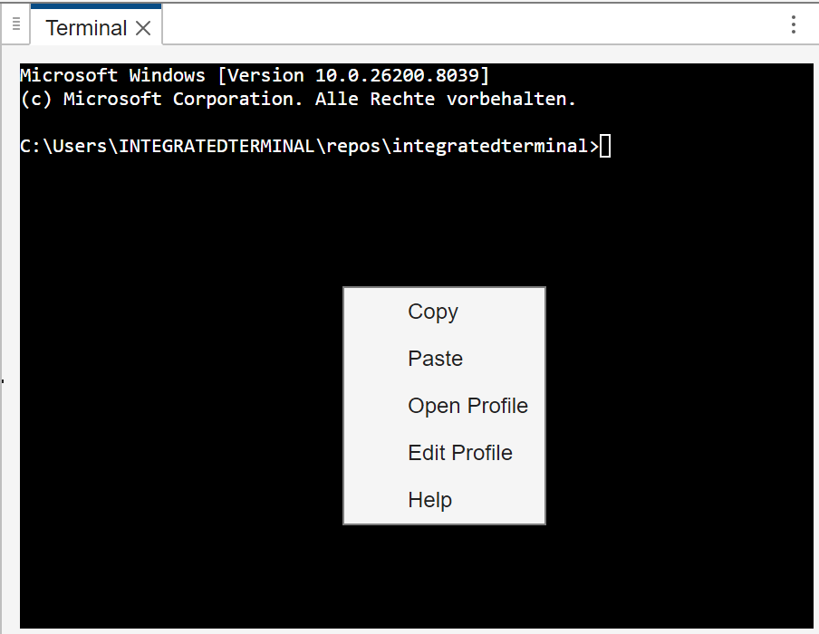
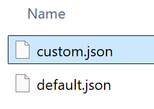

# Integrated Terminal


VS Code-style integrated terminal for the MATLAB IDE.

## Getting Started Guide
1. Download and install the toolbox from the releases page (LINK TBD), the MATLAB Central (LINK TBD) or the Add-On Explorer inside the MATLAB IDE.
2. Click the APPS tab on the MATLAB Toolstrip.
3. Click the dropdown arrow to show all apps.
4. Click the Integrated Terminal app. An integrated terminal with the default profile will be opened.

## Tutorial
### Adding a Profile
Open a new terminal and right click anywhere on the terminal. Select "Edit Profile".



A file browser will open showing the contents of the profiles folder. Copy and paste *default.json*. Rename the new file to *custom.json*. Double click *custom.json*. The profile *custom.json* will be opened in the editor.



Go back to the terminal. Right click and select "Open Profile". Double click *custom.json*. A new integrated terminal will be created with the profile *custom.json*.

### Changing the Shell
The shell that a profile uses is controlled by the key "Shell Path" in the profile JSON. Assuming you have the shell **magic.exe** installed at **C:/Magic/magic.exe**, you can make a profile use the shell by setting "Shell Path" to:

```
"Shell Path": "C:/Magic/magic.exe",
```

### Changing the Size
The size of the terminal is controlled by the "cols" and "rows" keys in the profile JSON:

```
"cols": 80,
"rows": 24,
```

### Changing the Font
You can set the key "fontFamily" to any CSS font family string. Refer to <https://www.w3.org/Style/Examples/007/fonts.en.html> for examples. To set the font to Times 8 pt. with fallback Times New Roman and last fallback serif family:

```
"fontFamily": "Times, Times New Roman, serif",
"fontSize": 8,
```

### Changing the Theme
### Changing the Behavior
### Adding a Shortcut
### Changing the Default Profile
Whichever profile is named *default.json* will be used as the default profile.

### Resetting the Default Profile
Delete *default.json* to reset the default profile to factory settings.

## Build From Source
In order to build `Integrated Terminal` from source the following prerequisites need to be installed and on the path:
- MATLAB R2023a or later (https://www.mathworks.com/products/matlab.html)
- Node.js with npm (https://nodejs.org/en)
- pkg (https://github.com/vercel/pkg)
- Pandoc (https://pandoc.org)
- WeasyPrint (https://weasyprint.org)
- Bash (on Windows you can use Git Bash or MSYS2)

Clone the repo and run **build.sh**. The toolbox installer will be located in the folder *build/*.

## FAQ
